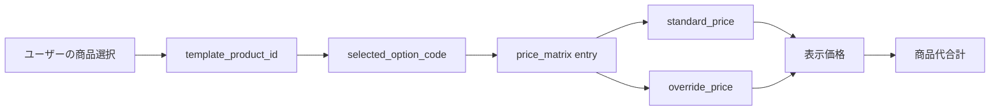

# Version1.2 Template01 商品選択仕様

## 目的

Template01「Garden Living展示場1号」で、ユーザーが商品を自由に選択・解除しながら完成イメージを切り替えられるようにする。

シーン選択UIへ変更しない。商品選択機能は維持する。

## 確定方針

- 初期表示はTemplate01のBefore画像（土の庭）。
- 人工芝、タイルデッキ、アメリカンフェンス、ガーデンファニチャー、ピザ窯はすべて未選択から開始する。
- 「人工芝 + タイルデッキ + ガーデンファニチャー」は初期値ではなく、おすすめ構成プリセットとしてワンタップで呼び出す。
- ユーザーは商品を自由に選択・解除できる。
- 価格は価格DBから取得し、画面側で合計する。
- `display_price` や粗利などの算出値は保存しない。
- Template01では「施工済み完成イメージがすぐ切り替わること」を優先する。

## 価格DBとの接続方針



価格表示の優先順位:

1. `override_price` がある場合はそれを表示
2. なければ `standard_price` を表示
3. 価格未設定なら「相談価格」

お客様表示:

- Garden Living物販: `商品代参考（税込）`
- 設置・施工が絡むもの: `設置費・組立費別途`

管理者内部:

- `standard_price`
- `override_price`
- `price_note`
- `price_updated_at`
- `price_source`

## 商品別仕様

### 1. 人工芝

#### 役割

土の庭を「使える庭」へ変える背景レイヤー。子ども、犬、裸足、庭時間のイメージを一番分かりやすく作る。

#### ユーザーが選択する項目

| 項目 | 内容 |
| --- | --- |
| 人工芝 | なし / あり |

#### 初期値

- `なし`

理由: 最初はBefore画像を見せ、ユーザー自身が商品を選ぶ体験を優先するため。

#### 選択肢数

- MVP: 2
- 将来: 施工範囲、グレード、下地オプションを追加可能

#### MVPに必要な選択肢

| 表示文言 | 内部値 | 説明 |
| --- | --- | --- |
| なし | `none` | Beforeの土状態 |
| あり | `turf_A` | 庭の主要部分へ人工芝を敷く |

#### 後回しにする選択肢

- 芝の種類
- 芝丈
- 色味
- 防草シート有無
- 施工範囲A/Bの切替

#### 組み合わせ画像数を増やしすぎない制限

- MVPでは人工芝は1パターンのみ。
- `turf_B` は作らない。
- 背景レイヤーとして他商品より先に固定する。

#### UI上の表示文言

- 商品名: `人工芝`
- 説明: `土の庭を、子どもや犬が遊びやすい芝庭に。`
- 選択ボタン: `人工芝を入れる`
- 解除ボタン: `人工芝を外す`
- 価格表示: `商品代参考（税込）`

#### 価格DB接続

- `product_id`: `template01_turf`
- `option_code`: `turf_A`
- 価格単位: Template01想定範囲一式
- 備考: 実案件では面積により変動

---

### 2. タイルデッキ

#### 役割

リビングと庭をつなぐ構造物。外で食事する、椅子に座る、庭に出る、という行動を作る。

#### ユーザーが選択する項目

| 項目 | 内容 |
| --- | --- |
| タイルデッキ | なし / あり |
| 色 | ナチュラルベージュ / グレージュ |
| サイズ | 標準 / 広め |
| 段数 | 1段 / 2段（本体 + ステップ） |

#### 初期値

- タイルデッキ: `なし`
- 色: `ナチュラルベージュ`
- サイズ: `標準`
- 段数: `1段`

理由: 初期表示はBefore画像に統一し、タイルデッキはユーザーが選ぶ商品として扱うため。

#### 選択肢数

- なし: 1
- あり: 色2 × サイズ2 × 段数2 = 8
- 合計: 9

#### MVPに必要な選択肢

| 表示文言 | 内部値 | 説明 |
| --- | --- | --- |
| なし | `none` | タイルデッキなし |
| 標準サイズ | `tile_A` | 掃き出し窓前へ標準サイズ |
| 広めサイズ | `tile_B` | 庭時間を広く使うサイズ |
| 1段 | `step_1` | 本体のみ |
| 2段（ステップ付き） | `step_2` | 本体 + ステップ |
| ナチュラルベージュ | `color_natural_beige` | 温かい庭向け |
| グレージュ | `color_greige` | 住宅外観に馴染む落ち着いた色 |

タイルは300×300サイズの施工イメージとする。

具体的なメーカー名や型番は前面に出さず、Only One Clubでよく使われる商品から大きく離れない施工イメージとして扱う。

#### 後回しにする選択肢

- 600角タイル
- 高級タイル
- 木目調タイル
- 複雑な段差
- 手すり
- 自由形状
- 複数メーカー選択

#### 組み合わせ画像数を増やしすぎない制限

- MVP仕様上は8状態を保持できる構造にする。
- ただし固定完成画像を全状態分作るか、タイルレイヤーとして共用するかはVersion1.3で判断する。
- 色、サイズ、段数を全自由にすると画像数が増えるため、よく使う構成はプリセットで優先表示する。

#### UI上の表示文言

- 商品名: `タイルデッキ`
- 説明: `リビングから庭へ出やすく、食事やくつろぎの場所に。`
- サイズ表示: `標準` / `広め`
- 段数表示: `1段` / `2段（ステップ付き）`
- 色表示: `ナチュラルベージュ` / `グレージュ`
- 価格表示: `商品代参考（税込）`
- 注意: `設置費・下地工事は別途`

#### 価格DB接続

- `product_id`: `template01_tile_deck`
- `variant_key`: `size + step + color`
- 価格単位: Template01想定範囲一式
- 表示価格: `standard_price` または `override_price`

---

### 3. アメリカンフェンス

#### 役割

庭の範囲を作り、ドッグラン感と安心感を出す。抜け感があり、Garden Livingらしい軽さを作れる。

#### ユーザーが選択する項目

| 項目 | 内容 |
| --- | --- |
| アメリカンフェンス | なし / あり |
| 配置パターン | 直線フェンス / ドッグラン向け囲い + ゲート |

#### 初期値

- アメリカンフェンス: `なし`
- 配置パターン: `直線フェンス`

理由: 初期表示でフェンスを入れると囲い込み感が出るため、ユーザーが目的に応じて追加する扱いにする。

#### 選択肢数

- なし: 1
- あり: 2
- 合計: 3

#### MVPに必要な選択肢

| 表示文言 | 内部値 | 説明 |
| --- | --- | --- |
| なし | `none` | フェンスなし |
| 直線フェンス | `fence_A` | 庭の境界を軽く整える |
| ドッグラン向け囲い + ゲート | `fence_B_gate` | 犬が遊べる囲いを作る |

ゲートはMVPへ含める。ただし独立したON/OFF項目にはせず、配置パターン `fence_B_gate` に含める。

#### 後回しにする選択肢

- ゲート単独ON/OFF
- 高さ違い
- 幅違い
- 支柱本数
- 細かい延長メートル
- コの字配置
- 自由ルート指定
- 看板やプレート

#### 組み合わせ画像数を増やしすぎない制限

- `fence_A_gate` は作らない。
- `fence_B_no_gate` は作らない。
- ゲートは「ドッグラン向け囲い」の一部として扱う。

#### UI上の表示文言

- 商品名: `アメリカンフェンス`
- 説明: `庭をゆるく囲って、ドッグランや遊び場らしく。`
- 配置表示: `直線フェンス` / `ドッグラン向け囲い（ゲート付き）`
- 価格表示: `商品代参考（税込）`
- 注意: `施工範囲により価格は変わります`

#### 価格DB接続

- `product_id`: `template01_american_fence`
- `variant_key`: `route_pattern`
- 価格単位: Template01想定延長一式
- 備考: 実案件では延長、支柱本数、基礎条件で変動

---

### 4. ガーデンファニチャー

#### 役割

庭で過ごす時間を想像させる演出商品。MVPでは商品販売より、庭時間のイメージ作りを優先する。

#### ユーザーが選択する項目

| 項目 | 内容 |
| --- | --- |
| ガーデンファニチャー | なし / あり |

#### 初期値

- ガーデンファニチャー: `なし`

理由: 初期表示はBefore画像とし、家具はユーザーが庭時間を足すための選択肢として扱う。

#### 選択肢数

- MVP: 2

#### MVPに必要な選択肢

| 表示文言 | 内部値 | 説明 |
| --- | --- | --- |
| なし | `none` | 家具なし |
| ダイニングテーブル + チェア | `furniture_A` | 外で食事できる代表セット |

#### 後回しにする選択肢

- 個別商品DB
- 販売リンク
- メーカー選択
- 素材選択
- 色選択
- 人数別セット
- ラウンジソファ
- パラソル
- BBQグリル

#### 組み合わせ画像数を増やしすぎない制限

- MVPでは家具は代表的なダイニングテーブル + チェアの1セットのみ。
- 完全な商品一致は求めず、庭で過ごす時間が伝わることを優先する。
- 家具は選択・解除できるが、商品販売としての詳細導線は後回しにする。

#### UI上の表示文言

- 商品名: `ガーデンファニチャー`
- 説明: `外で食事したり、少し休める場所を作ります。`
- 選択表示: `ダイニングテーブル + チェア`
- 価格表示: `商品代参考（税込）`

#### 価格DB接続

- `product_id`: `template01_garden_furniture`
- `variant_key`: `dining_set`
- 価格単位: セット一式

---

### 5. ピザ窯

#### 役割

Garden Livingらしさを強く出す象徴商品。休日の食事、家族時間、友人との時間を想像させる。

#### ユーザーが選択する項目

| 項目 | 内容 |
| --- | --- |
| ピザ窯 | なし / あり |

#### 初期値

- ピザ窯: `なし`

理由: ピザ窯を初期表示にすると用途が狭く見えるため、楽しみ要素として追加選択にする。

#### 選択肢数

- MVP: 2

#### MVPに必要な選択肢

| 表示文言 | 内部値 | 説明 |
| --- | --- | --- |
| なし | `none` | ピザ窯なし |
| あり | `pizza_A` | レンガ造り・アーチ型・薪収納付きの代表モデル |

MVPでは代表モデル1つだけを使用する。商品数は増やさない。

#### 後回しにする選択肢

- 大谷石モデル
- BBQ機能付き
- サイズ違い
- 色違い
- 薪置き・台座違い
- 設置場所A/B

#### 組み合わせ画像数を増やしすぎない制限

- MVPでは代表モデル1つのみ。
- 設置場所はTemplate01側で固定する。
- タイルデッキありの場合はデッキ脇、タイルデッキなしの場合は庭端へ寄せる。

#### UI上の表示文言

- 商品名: `ピザ窯`
- 説明: `休日に庭で食事を楽しむ、Garden Livingらしい象徴アイテム。`
- 選択ボタン: `ピザ窯を入れる`
- 価格表示: `商品代参考（税込）`
- 注意: `設置場所・搬入条件により別途`

#### 価格DB接続

- `product_id`: `template01_pizza_oven`
- `variant_key`: `representative_brick_arch`
- 価格単位: 商品本体参考価格
- 備考: 送料・搬入・設置は別途扱い

## 初期状態

Template01初期状態は、すべて未選択とする。

```json
{
  "turf": "none",
  "tile_deck": "none",
  "american_fence": "none",
  "garden_furniture": "none",
  "pizza_oven": "none"
}
```

理由:

- ページを開いた時点ではBefore画像を見せる。
- ユーザーが自分で選び、変化を確認する体験を優先する。
- 商品が最初から入っていると「提案を押し付けられている感」が出るため避ける。

## おすすめ構成プリセット

初期値にはしないが、ワンタップで呼び出せるおすすめ構成を用意する。

### 家族で過ごす庭

```json
{
  "preset_id": "family_garden_basic",
  "label": "家族で過ごす庭",
  "selection": {
    "turf": "turf_A",
    "tile_deck": "tile_A_step_1_color_natural_beige",
    "american_fence": "none",
    "garden_furniture": "furniture_A",
    "pizza_oven": "none"
  }
}
```

目的:

- 人工芝で庭の使いやすさを作る。
- タイルデッキと家具で「外で過ごす時間」を見せる。
- フェンスとピザ窯は初期提案から外し、ユーザーが追加で選ぶ余地を残す。

## 組み合わせ画像数の制御

MVPでは以下の状態数を採用する。

| 商品 | MVP状態数 | 備考 |
| --- | ---: | --- |
| 人工芝 | 2 | なし / あり |
| タイルデッキ | 9 | なし + 色2 × サイズ2 × 段数2 |
| アメリカンフェンス | 3 | なし + 直線 + ドッグラン向け囲いゲート付き |
| ガーデンファニチャー | 2 | なし + ダイニングセット |
| ピザ窯 | 2 | なし + 代表モデル |

全組み合わせを事前生成しない。

代わりに、以下の順で制御する。

1. よく使うおすすめ構成を固定画像として用意
2. 個別商品のON/OFFはレイヤー合成で対応
3. 不自然な組み合わせはUIで軽く案内
4. どうしても成立しない組み合わせは「相談推奨」へ逃がす

## 不自然な組み合わせの扱い

### 家具あり + 人工芝なし + タイルデッキなし

対応:

- MVPの固定画像制作対象から外す。
- UIでは家具を選べるが、「人工芝またはタイルデッキと合わせると自然です」と案内する。

### ドッグラン向け囲い + 人工芝なし

対応:

- MVPの固定画像制作対象から外す。
- ドッグラン用途は人工芝ありを基本とする。

### ピザ窯あり + タイルデッキ広め

対応:

- ピザ窯はデッキ上ではなく、デッキ脇または庭端へ固定する。

## 客用UIの表示順

スマホでは以下の順にする。

1. 完成イメージ
2. 商品代合計
3. おすすめ構成プリセット
4. 商品選択
5. 相談ボタン

商品選択の並び:

1. 人工芝
2. タイルデッキ
3. ガーデンファニチャー
4. アメリカンフェンス
5. ピザ窯

理由:

- 施工順に近い。
- ユーザーが庭のベースから考えやすい。
- フェンスとピザ窯を後に置くことで、初期の圧迫感と用途限定感を減らせる。

## お客様へ表示する項目

| 表示項目 | 表示するか | 備考 |
| --- | --- | --- |
| 商品名 | 表示 | 分かりやすい名称 |
| 短い説明 | 表示 | 1文だけ |
| ON/OFF | 表示 | 必須 |
| 色 | タイルのみ表示 | MVPでは2色 |
| サイズ | タイル、フェンスのみ簡略表示 | 細かい寸法は出しすぎない |
| 段数 | タイルのみ表示 | 1段 / 2段 |
| 参考価格 | 表示 | 税込参考 |
| 施工費 | 注意文のみ | 詳細計算しない |
| 型番 | 非表示 | 詳細または管理用 |
| 仕入価格 | 非表示 | 管理用 |
| 粗利 | 非表示 | 管理用 |
| 商品画像ID | 非表示 | 管理用 |

## 内部管理項目

| 項目 | 用途 |
| --- | --- |
| `template_id` | Template01識別 |
| `product_id` | 商品識別 |
| `layer_kind` | background / product |
| `render_group` | background / structure / equipment_furniture |
| `pattern_id` | A/Bまたは代表パターン |
| `variant_key` | 価格・画像接続 |
| `asset_id` | 合成用素材 |
| `z_index` | 表示順 |
| `conflict_rules` | 組み合わせ制限 |
| `standard_price` | 標準価格 |
| `override_price` | 管理者上書き価格 |
| `price_note` | 価格修正理由 |

## 確定済み項目

1. 初期状態はすべて未選択。
2. 「人工芝 + タイルデッキ + 家具」はおすすめ構成プリセット。
3. タイルデッキのMVP色はナチュラルベージュとグレージュ。
4. アメリカンフェンスのゲートは、ドッグラン向け囲いパターンへ含める。
5. ピザ窯はレンガ造り・アーチ型・薪収納付きの代表モデル1つ。
6. ガーデンファニチャーは、庭時間の演出として代表的なダイニングテーブル + チェア1セット。
